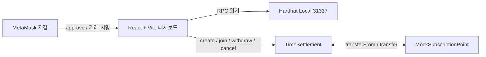

# DripPay 구조와 정산 규칙

## 구성



## 온체인 구성

### `MockSubscriptionPoint`

18자리 소수점을 쓰는 ERC-20 데모 포인트입니다. `mint`는 발표용 로컬 데이터 공급을 위해 제한하지 않았습니다.

### `TimeSettlement`

정산에는 아래 값이 저장됩니다.

| 값 | 의미 |
| --- | --- |
| `payee` | 파티장, 경과분을 받는 지갑 |
| `payer` | 파티원, 포인트를 예치하는 지갑 |
| `amount` | 총 예치 포인트 |
| `startedAt`, `endsAt` | 참여 시점과 종료 시점 |
| `withdrawn` | 이미 파티장이 가져간 금액 |
| `joined`, `cancelled` | 참여·취소 상태 |
| `inviteHash` | 참여 코드의 keccak256 해시 |

주요 함수는 다음과 같습니다.

| 함수 | 역할 |
| --- | --- |
| `createSettlement` | 고정 금액·기간과 참여 코드 해시로 정산 생성 |
| `joinSettlement` | 코드 검증 후 포인트를 예치하고 시작 시각 확정 |
| `getFinancials` | 경과분, 출금 가능액, 환불 가능액 계산 |
| `withdraw` | 파티장이 아직 인출하지 않은 경과분 수령 |
| `cancel` | 파티원에게 남은 금액을 돌려주고 정산 종료 |

## 계산식

전체 포인트를 `A`, 시작 후 지난 시간을 `t`, 총 기간을 `D`라고 할 때:

```text
earned       = A × min(t, D) / D
withdrawable = earned - withdrawn
refundable   = A - earned
```

취소 트랜잭션은 `withdrawable`을 파티장에게, `refundable`을 파티원에게 같은 트랜잭션에서 분배합니다.

## 참여 코드

브라우저가 혼동하기 어려운 8자리 대문자 코드를 만들고 keccak256 해시만 컨트랙트에 전달합니다. 한 번 참여하면 코드 조회 매핑을 비워 다시 참여할 수 없게 하며, 생성된 해시는 영구히 재사용하지 못합니다.

## 프런트엔드 안전장치

- 모든 쓰기 전 MetaMask의 체인 ID가 `31337`인지 다시 확인합니다.
- 로컬 테스트 ETH가 없거나 데모 포인트가 부족하면 MetaMask 거래창을 열기 전에 안내합니다.
- 지갑이 다른 네트워크로 바뀌면 쓰기 버튼을 막습니다.
- 앱의 `연결 해제`는 DripPay 화면 세션만 지웁니다. MetaMask 권한 자체를 강제로 제거하지는 않습니다.
- 연결된 앱 세션은 브라우저 `sessionStorage`의 상태 표지만 저장합니다. 주소나 private key를 저장하지 않습니다.

## 시간 표시의 해석

홈과 상세의 초 단위 흐름 표시는 마지막으로 읽은 체인 블록 시각에 브라우저 경과 시간을 더한 시각화입니다. 실제 출금·환불 금액의 최종 기준은 항상 거래가 포함된 블록의 `block.timestamp`와 `getFinancials`입니다. 따라서 화면은 흐름을 보여 주고, 컨트랙트는 실제 귀속 금액을 확정합니다.
